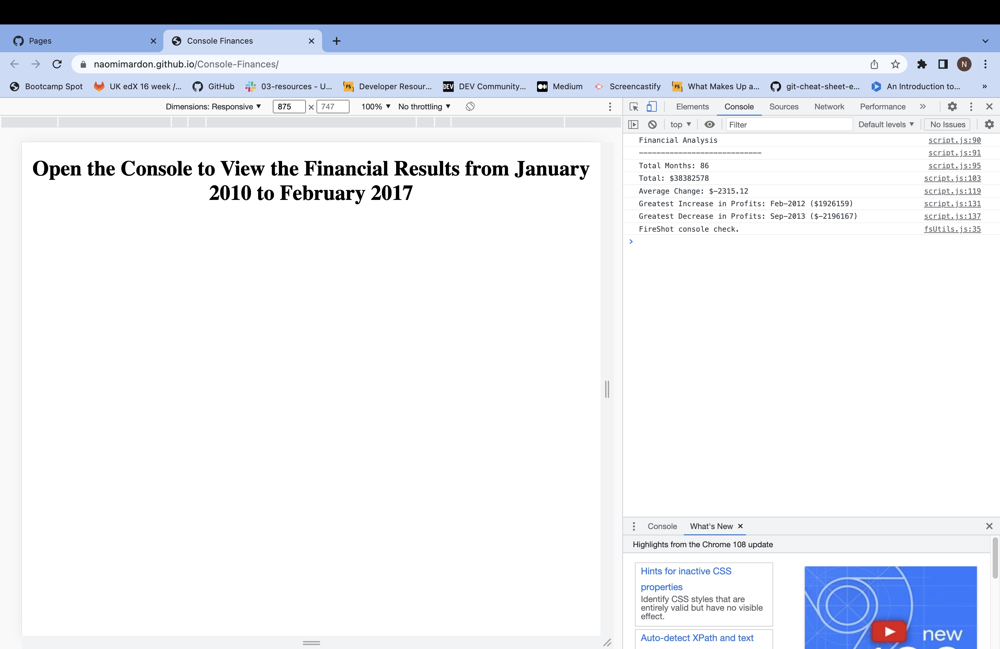

# Console-Finances
Using JavaScript to conduct financial analysis

## Description 

This webpage uses JavaScript to analyse the financial records of a company, producing a record of:
- The total number of months covered in the data;
- The total profit or loss to date;
- The average monthly change in profit or loss;
- The greatest monthly increase in profits and;
- The greatest monthly decrease in profits.

The deployed application can be found at: 

https://naomimardon.github.io/Console-Finances/

## Usage 

Open the console to view the completed financial analysis.

Here is a screenshot of the deployed application:

## License

Please refer to the license in the repo.

